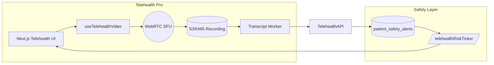

# Sprint 1 – Telehealth Pro & Klinik Güvenlik

## Amaç
Telehealth deneyimini rakiplerin "Pro" paketleri seviyesine yükseltmek ve real-time güvenlik/safety akışlarını tüm uzman rollerine entegre etmek.

## Modüler Kapsam
1. **Telehealth Pro Core**
   - Multi-provider meeting rooms (yakın ekip + konsultasyon)
   - Brandable waiting room (logo, renk, duyuru)
   - Session recording (S3 + KMS şifreleme) ve download erişim kontrolü
   - Otomatik transkript (Whisper veya AssemblyAI) + transcript diff
2. **Transcript Intelligence**
   - Risk keyword highlight
   - Psikiyatrist için Rx/yan etki bayrakları
   - Psikolog için emotion/affect etiketleri -> seans notu gönder
   - Sosyal hizmet uzmanı için "mandated reporting" uyarısı
3. **Real-time Safety Panel**
   - Telehealth seansı esnasında safety ticker (self-harm, medication, crisis-plan)
   - 911/112 warmline butonları + kriz protokol modalı
   - Risk alerti → otomatik caregiver notify butonu
4. **Caregiver Portal (beta)**
   - Telehealth katılım linki (token kontrollü)
   - Seans sonrası transcript özeti (guardrail'lı)
5. **Token/Audit Entegrasyonu**
   - Yeni token paneli ile telehealth davetleri -> caregiver tokens
   - Access logs → telehealth session metadata ile ilişkilendirilecek

## Teknik Mimari

## Task Breakdown
### Telehealth Pro Core
- [ ] `TelehealthRoomManager` servis modülü: multi-provider + role based join
- [ ] Waiting room brand config (Supabase table `telehealth_branding`)
- [ ] Recording pipeline: start/stop API + S3 signed URL + policy
- [ ] Transcript worker (Edge Function / backend script)

### Transcript Intelligence
- [ ] `telehealth_transcripts` tablosu: transcript, risk tags, action items
- [ ] Keyword/risk extractor (OpenAI function + guardrail)
- [ ] UI: transcript panelde highlight + "push to notes" butonu

### Real-time Safety Panel
- [ ] `/api/telehealth/risk-feed` → patient_id & session_id bazlı safety summary
- [ ] Telehealth UI: Risk badges + 911/112 buttons + crisis modal
- [ ] Safety alert create API (self-harm high → alert)

### Caregiver Portal Beta
- [ ] Caregiver portal sayfası (`/portal/caregiver?token=`) – Next.js SSR + RSC
- [ ] Telehealth join flow: token doğrula, caregiver view (read-only transcript, crisis plan)
- [ ] Notification: seans sonrası transcript özetini caregiver’a e-posta (Resend template)

### Token/Audit Integration
- [ ] Caregiver token panelini telehealth davet modallarıyla bağla
- [ ] Access log -> telehealth session metadata (session_id, room_id)

## Uzman Bazlı Deliverable
| Rol | Sprint 1 Çıktıları |
| --- | --- |
| **Psikiyatrist** | Telehealth Pro odasında risk badge + transkriptten ilaç/yan etki tespiti + krize tek tık 988 call |
| **Psikolog** | Transcript highlight → seans notuna push; emotion radar + homework önerisi (auto draft) |
| **Sosyal Hizmet Uzmanı** | Caregiver portal katılım linki + mandated reporting alert + crisis protokol checklist |
| **Yönetici** | Real-time safety board, recording governance (kim indirdi) ve brandable waiting room |

## Deliverable Tanımı
- Telehealth UI’de yeni "Pro" toggle → multi-provider, recording, transcript panel.
- `/dashboard/analytics/safety` sayfasında live ticker.
- Caregiver portal page + token daveti + e-posta bildirimi.
- Dokümantasyon: `docs/telehealth_pro.md` + runbook.

## KPI / Test
- [ ] Telehealth Pro seansında 2 provider + caregiver join → record + transcript oluşuyor mu?
- [ ] Safety ticker 3 risk tipinde (self-harm, medication, crisis-plan) gerçek zamanlı güncelleniyor mu?
- [ ] Caregiver portal token ile join ve transcript özetine erişim → access log kaydı var mı?
- [ ] Recording & transcript download sadece authorized role?

Hazır olduğunda kodlama aşaması: TelehealthRoomManager + UI revizyonu → backend API → caregiver portal.
